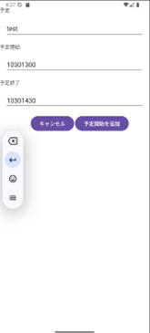

# Manage__task_and_schedule

タスクとスケジュールを管理するための Android アプリです。  
Android Studio を用いて Java で開発しました。

---

## 概要

タスクや予定を一覧形式で管理できるアプリです。  

---

## 開発環境

- Java
- Android Studio

---

## 主な機能

- タスク管理
- スケジュール管理
- スクロール可能なリスト表示による確認

---

## スクリーンショット

---

## 備考

現在はソースコードが消失しているため、アプリ画面の紹介のみを掲載しています。
